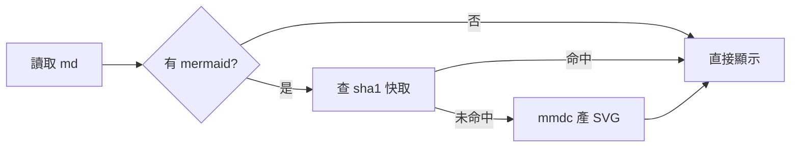
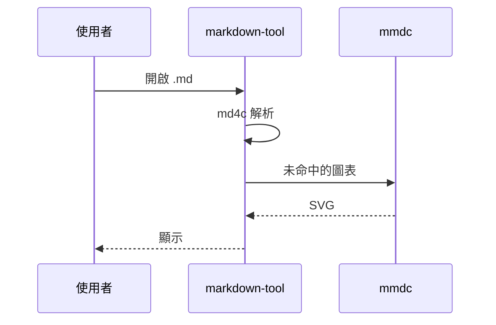

# markdown-tool 驗證文件

這份文件刻意涵蓋每一個 v0.1 該處理的語法，供手動驗收使用。

## 行內樣式

**粗體**、*斜體*、~~刪除線~~、`inline code`、[外部連結](https://example.com)、
[內部錨點](#表格)。

段落中的軟換行
應該併成同一段。

## 清單與待辦

- 一般項目
- 巢狀
  - 第二層
    - 第三層

1. 有序項目
2. 第二項

- [x] 已完成的待辦（應顯示為 ☑）
- [ ] 未完成的待辦（應顯示為 ☐）

## 引用

> 引用區塊第一行。
>
> 第二段引用。

## 表格

| 欄位 | 型別 | 說明 |
|:-----|:----:|-----:|
| key | string | 快取鍵 |
| dark | bool | 是否暗色 |
| 中文欄位 | int | 對齊測試 |

## 程式碼

```cpp
// C++ 高亮：關鍵字、字串、註解、數字
template <typename T>
static const T *find(const QString &name) {
    if (name.isEmpty()) return nullptr;   /* 區塊註解 */
    return &table[name];
}
```

```python
# Python 高亮
def slug(text: str) -> str:
    return "-".join(text.lower().split())
```

```bash
mmdc -i in.mmd -o out.svg -c mermaid.json -t dark -b transparent
```

```
沒有語言標記的區塊，應該只有等寬字與底色，不上色。
標籤也要被轉義：<script>alert(1)</script>
```

## mermaid





## 標題重複測試

### 重複

### 重複

### 重複

## 圖片

存在的圖片（若有）與不存在的圖片各一張：


## 分隔線

---

結束。
